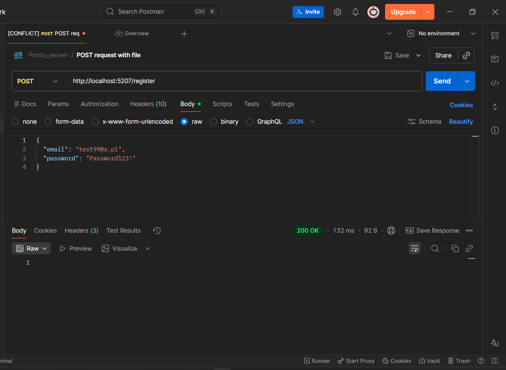
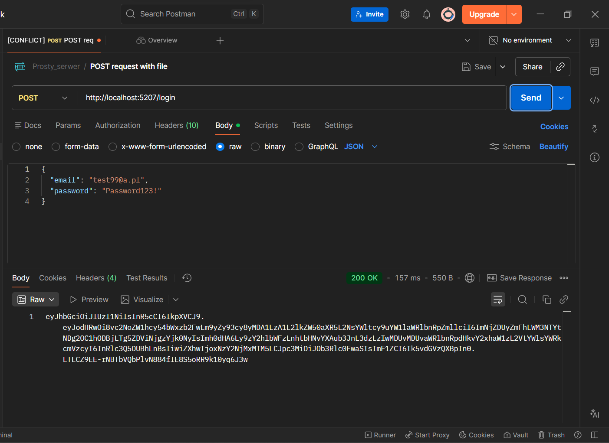

## 🧪 Scenariusz testowy API (Postman)

Poniżej przedstawiono kompletny scenariusz testowy REST API obejmujący:
rejestrację użytkownika, logowanie, autoryzację JWT oraz operacje na notatkach.

Rejestracja nowego użytkownika w systemie przy użyciu endpointu /register. Operacja zakończona kodem odpowiedzi 200 OK.

Logowanie użytkownika oraz wygenerowanie tokena JWT umożliwiającego dostęp do zasobów chronionych.

